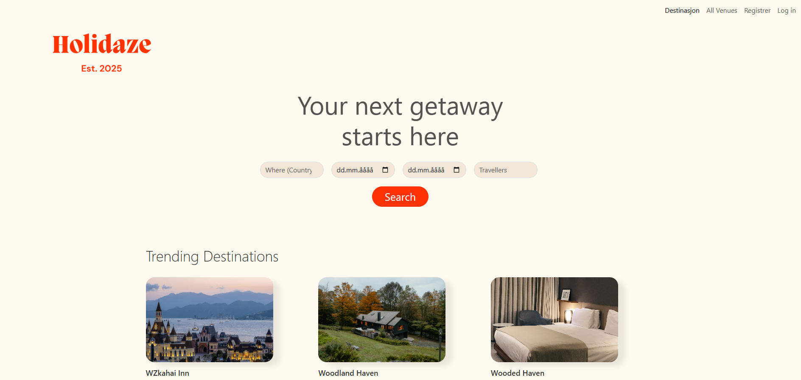

# Holidaze – Accommodation Booking Application




Holidaze is a modern accommodation booking frontend built with React.  
Users can search for venues, view details, check availability, and book directly.  
Venue managers can register, manage their venues, and view bookings.  

## Installation & Setup

**Repository:** 
```bash
git clone https://github.com/CecilieMari/Project-Exam-2.git
```

**Navigate into the project folder:** 
```bash
cd Project-Exam-2
```

**Install dependencies:** 
```bash
npm install
```

**Start the development server:** 
```bash
npm start
```
**The app will run at:** http://localhost:3000

## Live Demo

- ** Live Site**: [https://project-exam-holidaze.netlify.app/](https://project-exam-holidaze.netlify.app/)
- ** GitHub Repository**: [https://github.com/CecilieMari/Project-Exam-2](https://github.com/CecilieMari/Project-Exam-2)
- ** Project Board**: [https://github.com/users/CecilieMari/projects/6](https://github.com/users/CecilieMari/projects/6)
- ** Adobe XD Prototype**: [https://xd.adobe.com/view/910dd752-aa4e-4db5-bd88-6dde208c36ce-c45e/](https://xd.adobe.com/view/910dd752-aa4e-4db5-bd88-6dde208c36ce-c45e/)

## Features

- ✅ **User authentication** (login, register, logout)
- ✅ **Customer profile** (avatar upload, view bookings)
- ✅ **Venue manager profile** (create, update, delete venues)
- ✅ **Venue listing & search** with advanced filtering
- ✅ **Venue details** with calendar and booking functionality
- ✅ **Responsive design** (mobile & desktop)
- ✅ **Booking management** for venue managers

## How to Test

1. **Register as a customer** (email must end with @stud.noroff.no)
2. **Search for venues** by location, dates, or guest count
3. **Book a venue** and check it in your customer profile
4. **Register as a venue manager** to create and manage venues
5. **View customer bookings** as a venue manager

## Credits

Developed by **Cecilie Mari Monsen** as part of the Noroff Final Project Exam.


